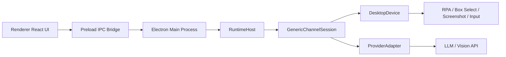
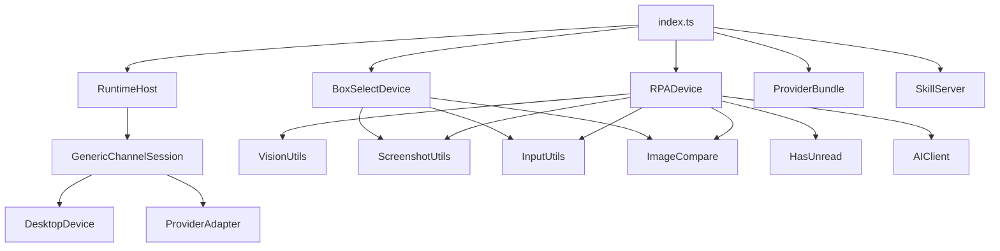

# 系统架构

## 1. 架构总览

项目采用典型的 Electron 多进程架构，并在主进程内部承载核心自动化运行时。

## 2. 进程职责

### 2.1 Main Process

主进程是项目的调度中心，职责最重：

- 创建主窗口与设置窗口
- 管理 `electron-store` 持久化配置
- 注册 IPC 接口
- 选择并实例化 `DesktopDevice`
- 加载内置或外部安装的 `Provider`
- 启动和停止 `RuntimeHost`
- 启动本地 Skill HTTP Server
- 触发框选向导并回收结果

### 2.2 Preload

Preload 层只做一件事：向渲染进程暴露安全可控的 `window.electron` API，避免渲染层直接访问 Electron 原生能力。

### 2.3 Renderer

Renderer 层是 React UI，主要承载：

- 目标应用选择
- 引擎启动/停止
- 日志展示
- 基础视觉配置
- Provider 安装、切换、配置
- 框选向导入口

## 3. 核心抽象层

## 3.1 RuntimeHost

`RuntimeHost<TState>` 是运行时宿主，负责：

- 维护运行状态
- 管理事件队列和定时器
- 按顺序分发 `SessionEvent`
- 调用 `ChannelSession`
- 将 Provider 输出重新投递为内部事件

这是一个轻量状态机容器，核心设计是“串行事件处理 + 定时重试”，避免桌面自动化并发造成的误点击和状态混乱。

## 3.2 ChannelSession

`GenericChannelSession` 是项目当前唯一的通用会话状态机，实现了“识别布局 -> 观察对话 -> 生成回复 -> 检查未读 -> 重试轮询”的主循环。

它不直接依赖微信、飞书等应用细节，只依赖 `DesktopDevice` 接口。因此：

- 切换设备实现不需要改状态机
- 微信专有逻辑下沉到 `RPADevice`
- 手动框选逻辑下沉到 `BoxSelectDevice`

## 3.3 DesktopDevice

`DesktopDevice` 是设备抽象层，定义了三类能力：

- 感知：布局测量、截图、未读检测、聊天区变化检测
- 动作：点击、切换会话、发送消息
- 生命周期：会话启动/停止时的缓存清理

它是项目最关键的可替换接口之一。

## 3.4 ProviderAdapter

`ProviderAdapter` 负责根据截图输出聊天事件流，最常见输出为：

- `thinking`
- `reply_text`
- `skip`
- `error`

主程序并不关心 Provider 内部如何调用模型，只负责消费这些标准化事件。

## 4. 两条布局测量路径

## 4.1 VLM 路线

适用场景：

- `wechat`
- `wework`

工作方式：

1. 通过 `RPADevice.measureLayout()` 调用视觉模型识别窗口布局。
2. 识别聊天区、输入框、未读入口、联系人等关键区域。
3. 将结果写入 `LayoutCache`。
4. 后续截图、diff、点击、发送全部消费缓存结果。

特点：

- 自动化程度高
- 依赖视觉接口密钥
- 成本和不确定性高于框选模式

## 4.2 Box Select 路线

适用场景：

- `dingtalk`
- `lark`
- `slack`
- `telegram`
- `generic`

工作方式：

1. 用户在透明覆盖窗口中框选 `contactList`、`chatMain`、`inputBox`。
2. `BoxSelectDevice.measureLayout()` 将矩形结果转为统一 `LayoutCache`。
3. 运行时只对当前会话做聊天区截图和像素 diff。

特点：

- 兼容性更强
- 不依赖视觉模型识别布局
- 默认不主动扫描联系人未读红点，只适合“当前打开会话”的自动回复

## 5. 依赖关系图

## 6. 架构设计特点

### 6.1 优点

- 分层清晰，UI、调度、设备、模型调用相互解耦
- `DesktopDevice` 与 `ProviderAdapter` 让项目同时具备“设备可替换”和“智能体可扩展”能力
- 主循环集中在 `GenericChannelSession`，便于定位运行时问题
- 通过 `electron-store` 和 Provider Bundle 机制实现较低成本的本地扩展

### 6.2 当前边界

- 主状态机目前基本是单通道、单实例运行
- 复杂 UI 状态大多集中在单文件 `App.tsx`
- RPA 可靠性高度依赖截图质量、窗口位置和模型识别结果
- `Box Select` 路线目前偏单会话轮询，不是完整多会话调度器
