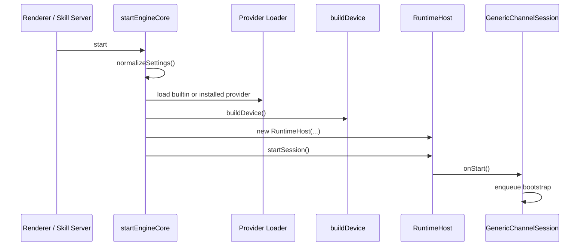

# 运行链路与依赖关系

## 1. 引擎启动链路

引擎启动由主进程统一发起，入口可以来自两类调用方：

- Renderer IPC：用户在 UI 中点击启动
- Skill HTTP Server：外部系统远程触发启动

启动步骤如下：



关键判断点：

- 是否已有运行中的 `runtime`
- 是否需要视觉密钥
- 当前 Provider 是否完整配置
- 当前 `appType` 应该走 `vlm` 还是 `box-select`
- `box-select` 路线是否已有持久化区域

## 2. 自动回复主循环

`GenericChannelSession` 的事件流是整个项目最关键的业务闭环。

### 2.1 状态机主路径

```text
bootstrap
  -> observe_chat
  -> provider.thinking / provider.reply_text / provider.skip / provider.error
  -> check_unread
  -> observe_chat 或 wait_retry
```

### 2.2 详细说明

1. `bootstrap`
   - 触发 `device.measureLayout()`
   - 成功则记录测量时间并进入 `observe_chat`
   - 失败则停止引擎

2. `observe_chat`
   - 调用 `device.screenshot()`
   - 把截图传给 `ProviderAdapter.run()`
   - Provider 逐步产出标准事件

3. `provider.reply_text`
   - 调用 `device.sendMessage()`
   - 建立聊天区 baseline
   - 进入 `check_unread`

4. `provider.skip`
   - 不发送消息
   - 同样建立 baseline
   - 进入 `check_unread`

5. `check_unread`
   - 先看当前聊天区是否有新变化
   - 再看是否存在未读会话
   - 若找到未读会话则尝试切换
   - 如果没有未读则进入下一轮 `wait_retry`

6. `wait_retry`
   - 延迟 5 秒左右后继续轮询

## 3. Provider 事件流

Provider 与主程序的协作是“异步迭代器 + 标准事件协议”。

### 3.1 输入

Provider 收到的核心输入是：

```ts
interface ProviderInput {
  screenshot: string
  appType: AppType
  currentContact?: string
  ocrText?: string
}
```

当前项目主路径中实际稳定使用的是：

- `screenshot`
- `appType`

### 3.2 输出

```ts
type ProviderEvent =
  | { type: 'thinking'; content: string }
  | { type: 'reply_text'; content: string }
  | { type: 'skip' }
  | { type: 'error'; error: string }
```

### 3.3 主程序处理方式

- `thinking` -> 转成 `provider.thinking`，展示日志
- `reply_text` -> 转成 `provider.reply_text`，由设备发送消息
- `skip` -> 转成 `provider.skip`
- `error` -> 转成 `provider.error`，进入重试逻辑

### 3.4 Provider 安装与加载链路

```text
manifestUrl
  -> 下载/读取 manifest.json
  -> validateManifest()
  -> 下载/读取 entry bundle
  -> 写入 userData/providers/<id>/<version>/
  -> loadInstalledProvider()
  -> resolve createProvider()
  -> 产出 ProviderAdapter
```

## 4. 设备依赖关系

## 4.1 `RPADevice` 依赖

`RPADevice` 依赖的下游模块较多：

- `AIClient`
- `vision-utils.ts`
- `screenshot-utils.ts`
- `has-unread.ts`
- `image-compare.ts`
- `input-utils.ts`
- `window-utils.ts`

它的能力结构如下：

```text
measureLayout
  -> getWechatWindowInfo
  -> detectUnreadArea
  -> detectWechatLayout
  -> setLayoutCache

screenshot
  -> captureChatMainArea

sendMessage
  -> sendReplyAction

check unread
  -> hasUnreadMessage
  -> isChatContactUnread
```

## 4.2 `BoxSelectDevice` 依赖

`BoxSelectDevice` 依赖更轻：

- `vision-utils.ts` 中的 `LayoutCache`
- `screenshot-utils.ts`
- `image-compare.ts`
- `input-utils.ts`

它不依赖 `AIClient` 进行布局测量，因此更适合作为兼容性兜底方案。

## 5. 配置流转

配置存储由 `electron-store` 管理，主结构是 `AppSettings`。

核心配置项：

- `locale`
- `appType`
- `vision.apiKey`
- `chatProvider.manifestUrl`
- `chatProvider.installed`
- `chatProvider.config`
- `defaultCaptureStrategy`
- `capture[appType]`

配置流转过程：

```text
Renderer 表单
  -> IPC settings:set
  -> normalizeSettings()
  -> electron-store 持久化
  -> startEngineCore() 读取
  -> buildDevice() / loadProvider()
```

## 6. 抓取策略选择逻辑

策略入口在 `resolveEffectiveStrategy()` 和 `buildDevice()`。

规则如下：

1. 优先读取当前 `appType` 的独立抓取策略。
2. 若该策略为 `auto`，则回退到全局默认策略。
3. 若全局默认策略仍为 `auto`：
   - 微信、企业微信使用 `vlm`
   - 其他应用使用 `box-select`

这意味着“不同 IM 应用使用不同默认策略”是内建规则，而不是前端约定。

## 7. 框选流程

框选流程由主进程发起，但 UI 运行在独立 renderer 入口。

步骤如下：

1. 用户点击“开始框选”
2. 主进程调用 `runBoxSelectWizard()`
3. 打开透明 overlay 窗口
4. 用户依次框选 3 个核心区域
5. 主进程收到结果后写入 `settings.capture[appType]`
6. `buildDevice()` 后续可直接复用持久化区域

## 8. Skill Server 与主引擎复用关系

Skill Server 并不是第二套引擎，它只是主引擎的 HTTP 封装层。

复用关系如下：

```text
POST /skill/start  -> controller.start() -> startEngineCore()
POST /skill/pause  -> controller.pause() -> stopEngineCore()
GET  /skill/status -> controller.isRunning()
```

这样设计的好处是：

- 避免 UI 启动和远程启动产生两套逻辑
- 错误码与业务状态保持一致
- 后续新增启动前校验时只需要改一处

## 9. 当前依赖方向总结

项目主依赖方向可以概括为：

```text
Renderer
  -> Preload
  -> Main
  -> RuntimeHost
  -> GenericChannelSession
  -> DesktopDevice + ProviderAdapter
  -> RPA primitives / LLM APIs
```

这个依赖方向说明：真正的业务核心在主进程和 `src/core`，不是在 React 页面。
